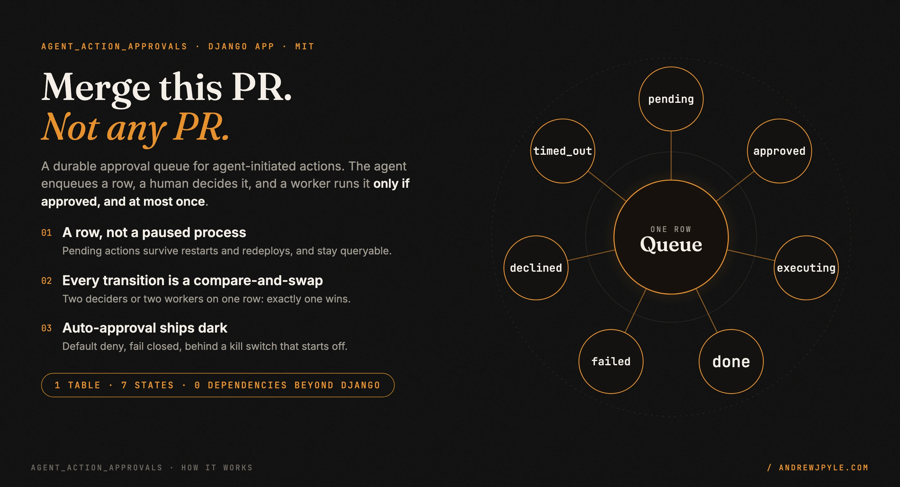
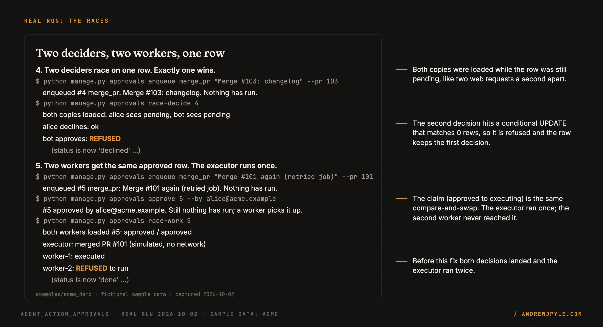
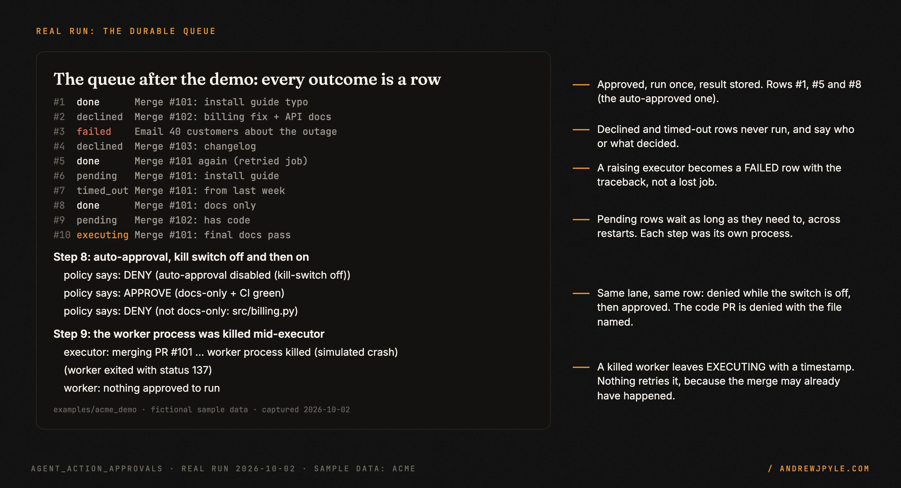
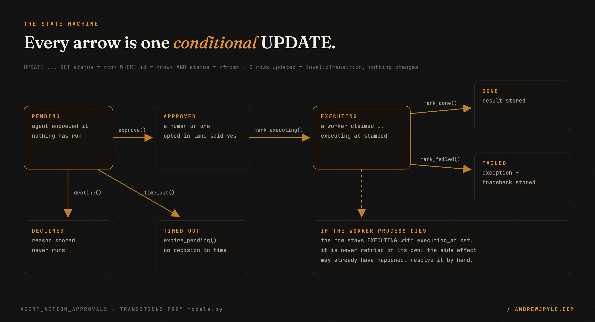

<p align="center">
  
</p>

<p align="center">
  <a href="https://github.com/andrewjpyle/agent_action_approvals/actions/workflows/ci.yml"></a>
  
  
</p>

# A durable approval queue for actions an AI agent wants to take

You want an agent to merge a pull request, unblock a deploy or send an email, and you want a person
to say yes first for the ones that matter. `agent_action_approvals` is a small Django app for that:
the agent writes a row, a human (or one narrow, opted-in rule) decides it, and a worker runs the
action only if it was approved, and at most once.

- **A row, not a paused process.** Pending actions survive restarts and redeploys, and you can query
  them: `ActionApproval.objects.filter(status="pending")`.
- **Races lose cleanly.** Two people deciding the same row, or two workers handed the same approved
  row: exactly one wins, and the executor runs once.
- **Failures stay visible.** A raising executor becomes a `failed` row with the traceback. A killed
  worker leaves an `executing` row with a timestamp, not a silent gap.
- **Auto-approval ships dark.** Default deny, fail closed, behind a kill switch that starts off.

> **The one idea worth stealing, even if you never run this code:** make the state change the lock.
> `if row.status == "approved": run(row)` lets two workers both pass the check, because each one
> loaded its own copy. `UPDATE ... SET status='executing' WHERE id=? AND status='approved'` returns 1
> for exactly one of them. Run the side effect only if your UPDATE changed a row.

---

## 60 seconds to the full lifecycle

The package is not on PyPI. Install it from this repo, then run the demo: a fictional company
(Acme Docs), simulated executors, no network, a throwaway sqlite file. Needs Python 3.10 or newer
(macOS's built-in `/usr/bin/python3` is 3.9; use a newer one).

```bash
git clone https://github.com/andrewjpyle/agent_action_approvals.git
cd agent_action_approvals
python3 -m venv .venv && . .venv/bin/activate
pip install .
sh examples/acme_demo/run_demo.sh
```

Every step is a separate `manage.py` process reading the same database. From the real run
([full transcript](examples/acme_demo/TRANSCRIPT.txt)):

```text
== 5. Two workers get the same approved row. The executor runs once.
$ python manage.py approvals race-work 5
  both workers loaded #5: approved / approved
  executor: merged PR #101 (simulated, no network)
  worker-1: executed
  worker-2: REFUSED to run (cannot mark_executing approval 7b394736-...: status is now 'done' (changed by another process), expected 'approved')
```

<p align="center"></p>

The demo walks nine steps: enqueue, decide in a later process, run, the two races, a fingerprint
that catches a changed PR, expiry, the auto-approval kill switch, and a worker killed mid-action.

<p align="center"></p>

## Wire it into your project

```bash
pip install "agent-action-approvals @ git+https://github.com/andrewjpyle/agent_action_approvals.git"
```

```python
INSTALLED_APPS = [..., "agent_action_approvals"]
```

```bash
python manage.py migrate agent_action_approvals
```

Then three pieces of your own code:

```python
from datetime import timedelta
from agent_action_approvals import ActionApproval, ExecutorRegistry, InvalidTransition

# 1. The agent enqueues. Nothing runs.
approval = ActionApproval.objects.create(
    action_type="merge_pr",
    title="Merge #1342: docs typo fix",
    action_payload={"owner": "acme", "repo": "web", "pr_number": 1342},
    requested_by="agent-session-abc123",
)

# 2. A human approves from your UI (or declines, with a reason).
approval.approve(by="alice@acme.example")

# 3. A worker runs the registered executor, out of band.
registry = ExecutorRegistry()
registry.register("merge_pr", merge_pr_executor)   # fn(approval) -> JSON-serializable dict
registry.execute(approval)   # claims the row, runs it, stores the result
```

Run `execute` from wherever you run background work (a Celery task, an RQ job, a thread), so an
HTTP approve returns immediately:

```python
@shared_task
def execute_approval(approval_id):
    registry.execute(ActionApproval.objects.get(pk=approval_id))
```

| API | What it does | The guard |
|---|---|---|
| `approve(by, expected_fingerprint=None, auto=False)` | pending to approved | compare-and-swap; `FingerprintMismatch` if the fingerprint changed |
| `decline(by, reason="")` | pending to declined | compare-and-swap |
| `time_out(reason=...)` | pending to timed_out | compare-and-swap, so it loses to an earlier approve |
| `ActionApproval.expire_pending(older_than=timedelta(...))` | bulk time-out of stale pending rows | one UPDATE filtered on `status="pending"` |
| `registry.execute(approval)` | approved to executing to done/failed | the claim is a compare-and-swap; a losing worker gets `InvalidTransition` before the executor runs |
| `AutoApprovalPolicy().classify(approval)` | `(should_approve, reason)` | kill switch off by default; no lane = deny; any exception = deny |

`InvalidTransition` subclasses `ValueError`, so existing `except ValueError` handlers still catch it.

**Expiry is a call, not a scheduler.** Run `expire_pending` from a periodic task (Celery beat, cron,
a management command) with whatever window suits you.

**The fingerprint catches a bait-and-switch.** Bind the approval to what was reviewed, then check it
again at approve time:

```python
from agent_action_approvals.models import fingerprint

approval = ActionApproval.objects.create(..., diff_fingerprint=fingerprint(*sorted(changed_paths)))
# at approve time, re-fetch and re-hash:
approval.approve(by="alice", expected_fingerprint=fingerprint(*sorted(current_paths)))
# FingerprintMismatch if the PR changed since review
```

The check is opt-in: with no `expected_fingerprint`, `approve` skips it.

### Auto-approval: default deny, fail closed, ships dark

```python
from agent_action_approvals import AutoApprovalPolicy

policy = AutoApprovalPolicy()                       # reads AGENT_ACTION_AUTO_APPROVE_ENABLED, off by default
policy.register("merge_pr", classify_docs_only)     # opt ONE lane in

should, reason = policy.classify(approval)
if should:
    approval.approve(by="auto", auto=True)
```

- **Default deny.** An `action_type` with no registered classifier is never auto-approved.
- **Fail closed.** Any exception in a classifier resolves to deny.
- **A kill switch, off by default.** Until `AGENT_ACTION_AUTO_APPROVE_ENABLED` is `1`, `true`, `yes`
  or `on`, the policy denies everything.

[`examples/docs_only_merge.py`](examples/docs_only_merge.py) is a worked GitHub lane: it approves a
PR only when every changed file is `.md`, `.mdx`, `.txt` or `.rst` (old names of renamed files
included) and CI is green, reading the PR from the GitHub API instead of trusting the payload. It
records the head sha it reviewed, and its executor passes that sha to GitHub's merge API, so a
commit pushed after review blocks the merge. It needs `requests` and a `GITHUB_TOKEN`; the core app
does not.

## How it works

<p align="center"></p>

One model, `ActionApproval`, with seven states. Each transition method runs a single
`UPDATE ... WHERE id = <row> AND status = <expected>`. If it changes one row, the transition
happened and the instance is updated to match. If it changes zero rows, another process got there
first: the instance reloads from the database and raises `InvalidTransition`, and the row keeps the
first decision.

`ExecutorRegistry.execute` owns the execution states so a broken executor cannot leave a row lying
about itself: it claims the row (`approved` to `executing`, stamping `executing_at`), calls your
function, and records `done` with the result or `failed` with the error and traceback. It never
re-raises an executor's exception, because a raise inside a background worker is easy to miss and a
`failed` row is not.

## Scope: what it does not do

- **No retry for a worker that dies mid-action.** After a SIGKILL or OOM, no Python code runs, so the
  row stays `executing`. That is deliberate: the merge or email may already have happened, and a
  blind retry could do it twice. Find these rows with
  `ActionApproval.objects.filter(status="executing", executing_at__lt=cutoff)` and resolve them by hand.
- **No UI, notifications, or permissions.** `decided_by` is a free string. Who may approve what is
  your application's call, enforced before you call `approve`.
- **No scheduler.** Nothing expires or executes on its own; you call `expire_pending` and
  `registry.execute` from your own task runner.
- **No exactly-once.** The queue guarantees an executor is *started* at most once per row. Whether
  the outside system sees the effect once is up to your executor (idempotency keys, a pinned sha).
- **Tested on SQLite.** The compare-and-swap is a plain Django `filter(...).update(...)`, which every
  Django backend supports, but CI runs SQLite only.

## The patterns

| Pattern | The failure it prevents |
|---|---|
| Every transition is a conditional UPDATE | two deciders both landing, or an executor running twice |
| The claim happens before the executor runs | a retried job merging the same PR again |
| Pending actions live in a table | a redeploy silently dropping every action waiting for a human |
| The registry records failures as rows | an exception in a background worker that nobody sees |
| Leave a killed run in `executing`, never auto-retry | a side effect done twice because a crash looked like "not done" |
| Fingerprint at enqueue, re-check at approve | approving a PR that gained code after review |
| Auto-approval: default deny, fail closed, kill switch off | an auto-lane widening by accident, or approving on an error |
| Classifier reads the source of truth, not the payload | an agent marking its own change "docs only" |

## FAQ

**Why not keep the agent paused in memory until someone answers?** A paused process holds the
pending action only as long as it lives. A row survives a redeploy and the weekend, and anyone can
list what is waiting.

**What happens if two people click approve and decline at the same moment?** One UPDATE matches the
pending row and wins; the other matches zero rows and gets `InvalidTransition`. The demo's step 4
shows it.

**Does it need Celery?** No. `registry.execute(approval)` is a plain function call. Use whatever runs
your background work, or call it inline in a script.

**What versions does it support?** CI runs Python 3.10 with Django 4.2, Python 3.12 with Django 5.2,
and Python 3.13 with the latest Django.

## Development

```bash
pip install django
python runtests.py    # 37 tests, in-memory SQLite, no host project needed
```

The suite covers the state machine, both races, expiry, the fingerprint, the registry's failure
handling, the auto-approval safety rules, the docs-only GitHub lane against a fake `requests`, and a
check that the models match the migrations. CI also runs the demo and checks its safety lines.

The README graphics are built from code and from a committed capture of the demo run:
`python docs/assets/src/build.py`, then
`uv run --with playwright==1.56.0 --with pillow python docs/assets/src/render.py docs/assets/src docs/assets`.

## Roadmap

- A management command to list rows stuck in `executing` past a threshold.
- CI against PostgreSQL alongside SQLite.

## License

MIT. By [Andrew Pyle](https://andrewjpyle.com). One of the reusable parts listed at
[autonomousaj.com/parts](https://autonomousaj.com/parts).
